# 📊 Diagram Formatting Rules for Project Documentation

Este archivo define los **estándares de visualización** para documentación técnica en todos los proyectos.

## 🎯 Objetivo

Todos los diagramas deben generarse en **formatos basados en texto** que puedan renderizarse en markdown, git, o entornos VSCode (GitHub, Obsidian, Cursor, Vercel Docs).

---

## 🧠 General Guidelines

- Siempre usar **formatos basados en texto** (Mermaid, PlantUML, Graphviz DOT, o extensiones de Markdown) — no imágenes a menos que se solicite explícitamente.
- Los diagramas deben ser **copy-paste runnable**, permitiendo renderizado o edición instantánea.
- Usar **nombres de nodos consistentes** con etiquetas claras (evitar oraciones largas).
- Cuando sea posible, **agrupar secciones por etapa**: Frontend / Backend / Infra / Data.

---

## 🧭 Format Rules by Diagram Type

### 1️⃣ **Process or Flow Documentation**

Usar **Mermaid flowcharts**:

```markdown
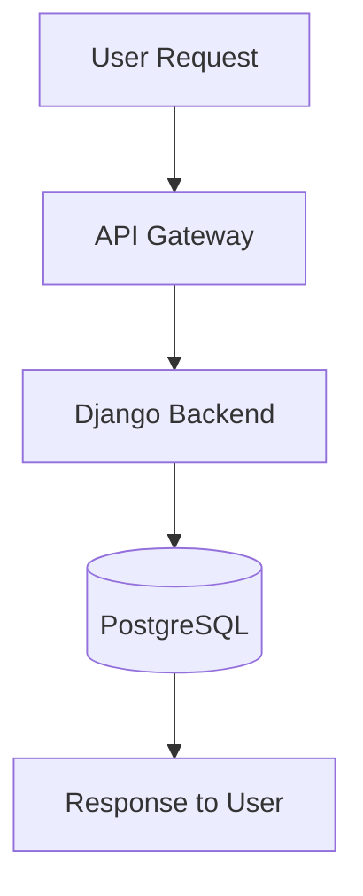
```

**Directivas disponibles:**
- `TD` → top to bottom
- `LR` → left to right
- `RL` → right to left
- `BT` → bottom to top

**Formas de nodos:**
- `[]` → proceso rectangular
- `[()]` → base de datos / storage
- `{}` → decisión / condicional
- `(())` → círculo / evento
- `[[ ]]` → subroutine / módulo

---

### 2️⃣ **API or System Interactions**

Usar **sequence diagrams** para mostrar flujo de mensajes entre componentes:

```markdown
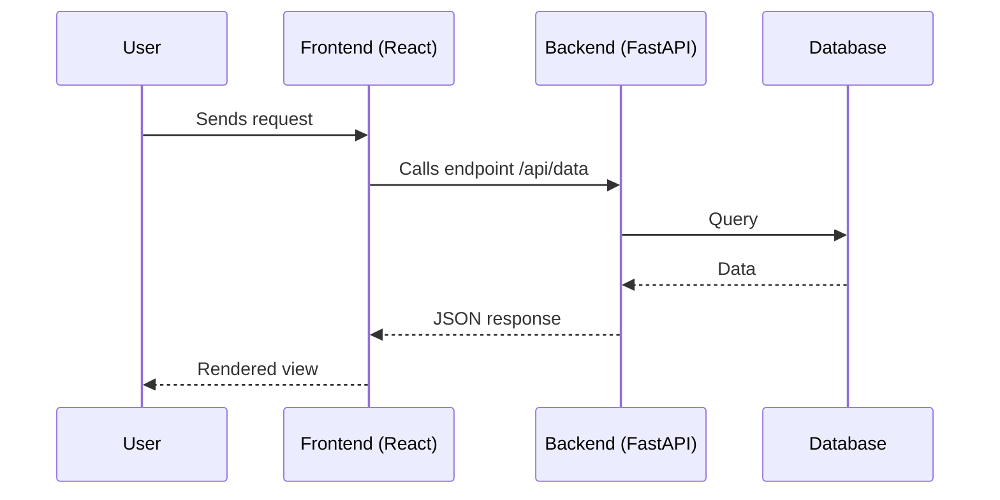
```

**Tipos de flechas:**
- `->>` → mensaje síncrono
- `-->>` → respuesta / mensaje asíncrono
- `-x` → mensaje que falla
- `-->` → mensaje dotted

---

### 3️⃣ **Database Models / ORM**

Usar **Mermaid ER diagrams** para relaciones entre entidades:

```markdown
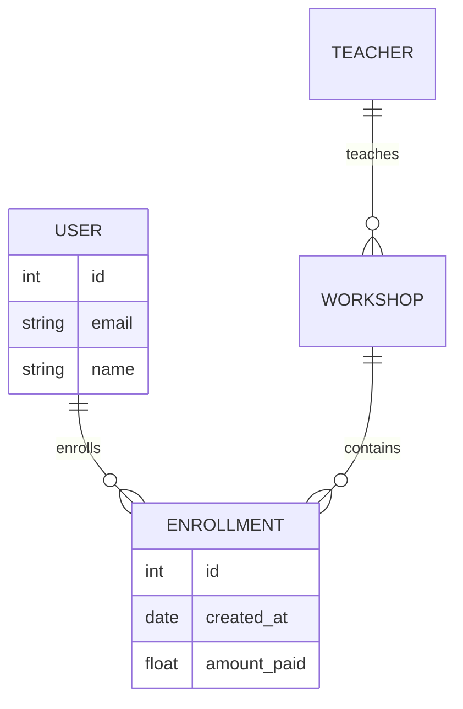
```

**Cardinalidades:**
- `||--||` → one to one
- `||--o{` → one to many
- `}o--o{` → many to many
- `||--o|` → one to zero or one

---

### 4️⃣ **Software Architecture / Components**

Usar **PlantUML component diagrams** cuando la arquitectura involucra múltiples servicios o containers:

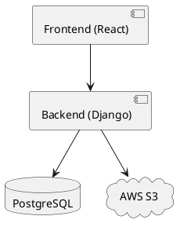

**Cuándo usar PlantUML vs Mermaid:**
- ✅ PlantUML: Arquitecturas complejas, múltiples capas, deployment diagrams
- ✅ Mermaid: Casos más simples, mejor soporte en GitHub/VSCode

---

### 5️⃣ **Infrastructure (AWS / Docker / Cloud)**

Usar **Graphviz DOT** notation para infraestructura:

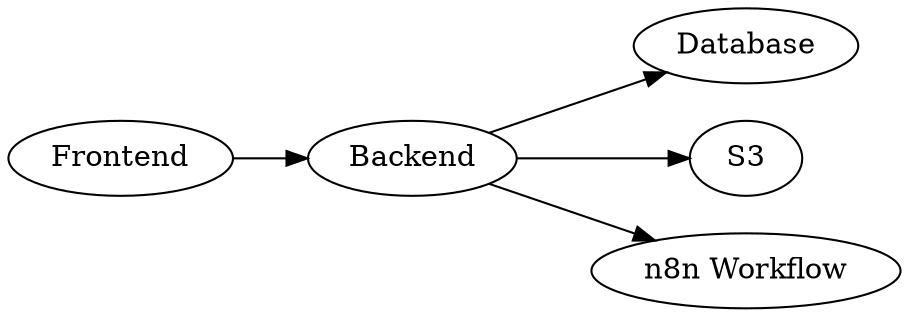

**Alternativa: Python Diagrams** (cuando se necesita código ejecutable):

```python
from diagrams import Diagram
from diagrams.aws.compute import EC2
from diagrams.aws.database import RDS

with Diagram("AWS Architecture"):
    EC2("Web Server") >> RDS("Database")
```

---

### 6️⃣ **Project Timelines or Phases**

Usar **Mermaid Gantt** para sprints o milestones:

```markdown
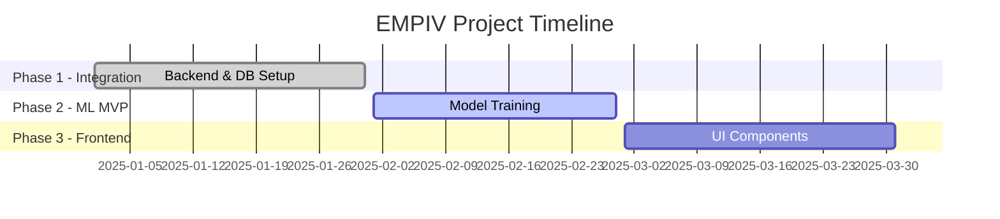
```

**Estados disponibles:**
- `done` → tarea completada
- `active` → tarea en progreso
- `crit` → tarea crítica
- `milestone` → hito importante

---

### 7️⃣ **State Machines / Workflows**

Usar **Mermaid state diagrams** para estados y transiciones:

```markdown
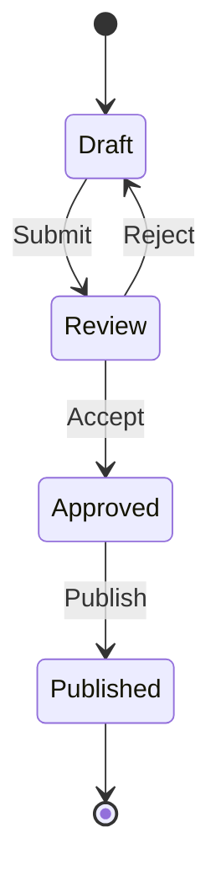
```

---

### 8️⃣ **Class Diagrams / OOP Structure**

Usar **Mermaid class diagrams** para diseño orientado a objetos:

```markdown
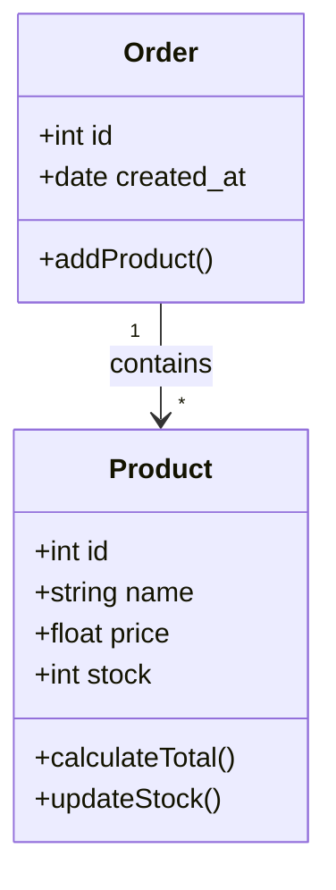
```

---

## 🧩 Output Rules for Claude

Cuando documentes o respondas con diagramas:

1. **Detectar** el contexto (flow, arquitectura, modelo de datos, etc.)
2. **Seleccionar** el formato correspondiente de arriba
3. **Envolver** el output entre triple backticks con el tag de lenguaje apropiado
4. Si hay múltiples diagramas, incluir un título corto arriba de cada uno

---

## ✅ Example Combined Output

Al documentar un sistema completo, combinar múltiples tipos de diagramas:

```markdown
### EMPIV System Overview

#### System Flow
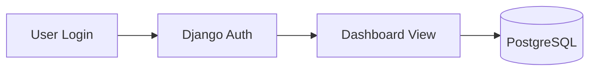

#### Data Model

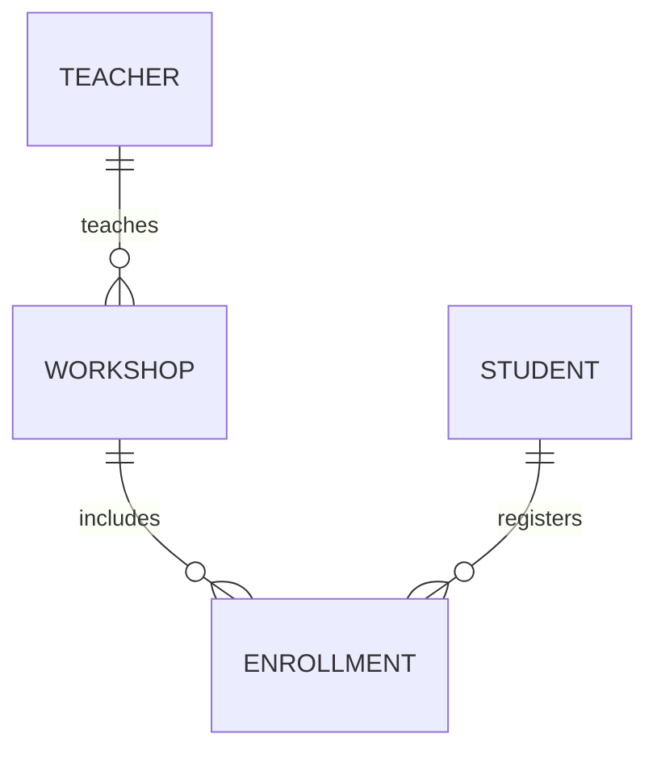

#### API Interaction

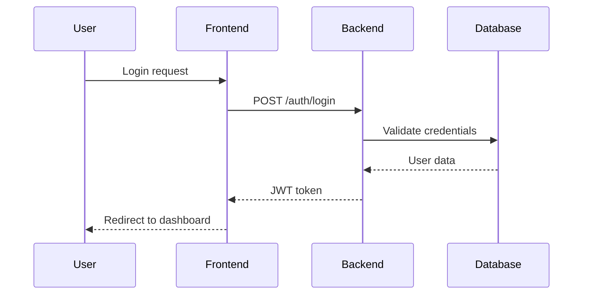
```

---

## 📌 Priority Hierarchy

Cuando elijas el formato, usa este orden de prioridad:

**1. Mermaid** (default, mejor soporte)
   - ✅ GitHub native rendering
   - ✅ VSCode plugins
   - ✅ Obsidian support
   - ✅ Fácil de editar

**2. PlantUML** (arquitecturas complejas)
   - ✅ Más opciones de visualización
   - ✅ UML completo
   - ⚠️ Requiere plugin/renderer

**3. Graphviz DOT** (infraestructura)
   - ✅ Grafos complejos
   - ✅ Control fino de layout
   - ⚠️ Requiere Graphviz instalado

**4. Python Diagrams** (infra como código)
   - ✅ Diagramas ejecutables
   - ✅ Iconos de cloud providers
   - ⚠️ Requiere ejecución, no inline

---

## 🎨 Best Practices

### ✅ DO (Hacer)

1. **Nombres descriptivos pero concisos**
   ```mermaid
   flowchart LR
       A[User Authentication] --> B[JWT Generation]
   ```

2. **Agrupar componentes relacionados**
   ```mermaid
   flowchart TD
       subgraph Frontend
           A[React App]
           B[Components]
       end
       subgraph Backend
           C[Django]
           D[FastAPI]
       end
       A --> C
       A --> D
   ```

3. **Incluir leyendas cuando sea necesario**
   ```mermaid
   flowchart TD
       A[Process] -->|success| B[Next Step]
       A -->|failure| C[Error Handler]
   ```

### ❌ DON'T (No hacer)

1. **Evitar oraciones largas en nodos**
   ```mermaid
   flowchart LR
       A[This is a very long description that makes the diagram hard to read]
   ```

2. **No crear diagramas demasiado complejos** (dividir en múltiples)
   - Si un diagrama tiene más de 15-20 nodos, considera dividirlo

3. **No usar imágenes cuando el texto es posible**
   - ❌ ![diagram.png]
   - ✅ ```mermaid ... ```

---

## 📚 Quick Reference

| Necesitas mostrar... | Usar... | Formato |
|----------------------|---------|---------|
| Flujo de proceso | Mermaid Flowchart | `flowchart TD/LR` |
| Comunicación API | Mermaid Sequence | `sequenceDiagram` |
| Modelo de datos | Mermaid ER | `erDiagram` |
| Arquitectura de sistema | PlantUML Component | `@startuml` |
| Infraestructura cloud | Graphviz DOT | `digraph G` |
| Timeline / Sprint | Mermaid Gantt | `gantt` |
| Estados / Workflow | Mermaid State | `stateDiagram-v2` |
| Clases OOP | Mermaid Class | `classDiagram` |

---

## 🔗 Referencias

- [Mermaid Documentation](https://mermaid.js.org/)
- [PlantUML Documentation](https://plantuml.com/)
- [Graphviz Documentation](https://graphviz.org/)
- [Python Diagrams](https://diagrams.mingrammer.com/)

---

**Próximo paso:** Aplicar estos estándares en toda la documentación del proyecto para mejorar comprensión y comunicación.
